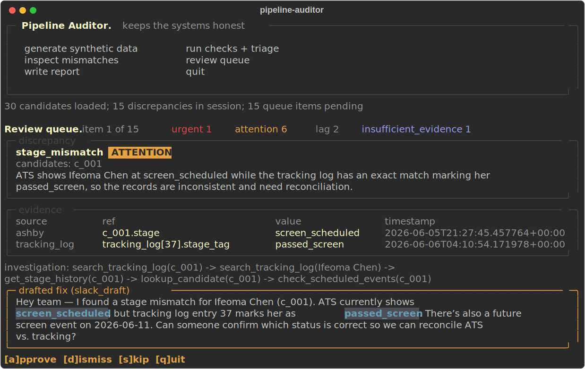

# pipeline-auditor

An agent that keeps a hiring pipeline's systems honest. It detects where the
source of truth (an ATS-style export) and the tracking layer (a Slack/Notion-style
log) disagree, drafts the fixes, and writes the weekly report. **A human
approves every change. It proposes; the human disposes.**

All data is synthetic — real candidate information shouldn't leave its system
of record.



## Run it

```bash
python3 -m venv .venv && .venv/bin/pip install -r requirements.txt
.venv/bin/python generate_data.py --n 30 --seed 42
.venv/bin/python audit.py tui
```

Everything happens inside one terminal UI:

| Key | What it does |
|-----|--------------|
| `g` | generate a fresh synthetic candidate pool (`--n`, `--seed` prompts) |
| `c` | run the six drift checks, then the investigation agent triages each finding |
| `i` | inspect any mismatch — both systems side by side, the disagreeing fields in red |
| `v` | review queue: approve / dismiss each drafted fix, one screen at a time |
| `p` | write the weekly report + Slack digest (and push to Notion if configured) |
| `q` | quit |

Without `OPENAI_API_KEY` set, triage falls back to offline mode (severity
mapped from `rules.yaml`) — the full loop still runs. With the key set, an
investigation agent examines each discrepancy before judging it.

Prefer plain commands? The same loop is scriptable:
`audit.py run` → `audit.py review` → `audit.py report [--push-notion]`.

## What it does

```
generate/load data → normalize → detect drift → agent triage → human review → weekly report
       (g)            (script)       (c)            (c)           (v)            (p)
```

1. **Ingest** two sources: `data/ashby_export.json` (source of truth) and
   `data/tracking_log.json` (messier: names not ids, informal stage tags).
2. **Normalize** into one canonical model. Identity resolution runs
   exact → casefolded → fuzzy (`rapidfuzz`); anything below the threshold is
   flagged, never silently merged.
3. **Detect** six deterministic drift checks (`auditor/drift.py`). No AI in
   this layer: stage mismatch, ghosts (both directions), stale, scheduling
   limbo, owner gap, duplicate-suspect names.
4. **Triage**: one investigation per discrepancy. The agent gets four
   read-only tools (`lookup_candidate`, `get_stage_history`,
   `search_tracking_log`, `check_scheduled_events`) and decides for itself
   what evidence it needs — hard-capped at 8 tool calls. A structured
   judgment (severity, one-line explanation, drafted fix, cited evidence) is
   validated by pydantic. `insufficient_evidence` is a legal answer.
5. **Review** (`v`): one screen per item — discrepancy, evidence table, the
   agent's actual investigation trace, drafted fix.
   `[a]pprove / [d]ismiss / [s]kip / [q]uit`. Approved drafts land in
   `out/sent_drafts/` and post to Slack **at the moment of approval** if a
   bot token is configured — never before, never on their own.
6. **Report** (`p`): `out/report.md` (role × stage snapshot, week-over-week
   movement, data-hygiene section) + `out/digest.txt` for Slack.

Decisions persist across runs by fingerprint — a dismissed item stays
dismissed even after re-running the checks. Fresh start: delete
`out/queue.json` or generate with a new seed.

## Design decisions

- **Auditor, not syncer.** The source of record is never auto-edited.
  Nothing sends without a human approval first.
- **Deterministic where possible, agent where judgment is needed.** Finding
  and displaying mismatches is pure rule-based code; the agent only judges
  severity and drafts fixes. The agent can't add or remove findings.
- **Every agent conclusion cites its evidence**, and the investigation trace
  in the queue comes from the tool wrapper's own log — what the agent
  actually did, not what it claims it did.
- **Ambiguity is flagged, never silently merged.** Unresolvable names become
  ghost discrepancies, not guesses.
- **Disagreement between systems is signal, not noise.**
- **Built for today's scale, designed for the stated one** (8–10 hires/month).
  `--n 300` runs the same loop unchanged.
- **Legible.** Plain JSON in, three files out, thresholds in `rules.yaml`.
- **The TUI wears the company's visual language** — palette and patterns
  derived from the production site (see `auditor/theme.py`).

### Decisions that override the original SPEC (recorded on purpose)

1. **LangChain + OpenAI for the agent loop** (SPEC chose the raw `anthropic`
   SDK; later directives moved it to LangChain, then to OpenAI models).
   `create_agent` runs the investigation on `gpt-5.4-mini` (see `rules.yaml`
   for the upshift note); `with_structured_output(TriageJudgment)` emits the
   validated judgment. The 8-call cap stays ours: a shared counter in the
   tool wrappers, with the graph's `recursion_limit` as backstop.
2. **Everything is committed scope** (SPEC had a cut order): full-loop TUI,
   Notion push, Slack push, all six checks, fuzzy matching are all in.
3. **`duplicate_threshold: 85`** (SPEC example said 90): measured
   `WRatio("Jon Smith", "Jonathan Smith") = 85.5`. The generator filters
   sampled names at the same threshold, so clean data can't collide with it.

## Provably catches what was planted

`generate_data.py` writes `data/planted_drift.json` — a manifest of exactly
which drift was injected. The test suite asserts full recall **and zero false
positives** against it at `--n 30` and `--n 300`:

```bash
.venv/bin/python -m pytest tests/ -q
```

## Slack push (behind the approval gate)

```bash
# Slack app with chat:write + chat:write.public, installed to the workspace:
# put SLACK_BOT_TOKEN=xoxb-... in .env
```

Hitting `[a]pprove` in the review queue posts that draft to the candidate's
role channel (`#hiring-fde`, …) the moment you approve it; if the role channel
doesn't exist, it falls back to `rules.yaml: slack.default_channel` with a
note. This is the app's only Slack transmit path and it runs strictly
**after** the human decision. Without the token, approval writes the draft to
`out/sent_drafts/` only. A Slack failure never loses the decision.

## Notion push (output-only)

```bash
# Internal integration with the target database shared to it:
# put NOTION_TOKEN=... and NOTION_DATABASE_ID=... in .env
```

`p` (or `audit.py report --push-notion`) writes one page per report: snapshot
as a table block, hygiene as callouts. It writes the report and nothing
else — it never reads or syncs. Markdown remains the default path.

## Repo map

```
audit.py                 entry point: tui / run / review / report
generate_data.py         synthetic data + planted-drift manifest (test oracle)
rules.yaml               thresholds, severity weights, channels, model choice
auditor/
  models.py              pydantic models, the shared vocabulary
  normalize.py           two sources → canonical model; identity ladder
  drift.py               the six checks, pure functions
  agent_tools.py         four read-only tools + the call budget
  triage.py              investigate (create_agent) → judge (structured output)
  queue.py               approval queue: persistence + review screens
  tui.py                 full-loop TUI shell
  report.py              report.md + digest.txt
  slack_push.py          posts approved drafts (the only Slack transmit path)
  notion_push.py         output-only Notion publisher
  theme.py               brand-derived terminal theme
assets/tui.svg           the screenshot above (rendered by Rich)
tests/                   unit + recall-against-manifest integration tests
out/                     queue.json, sent_drafts/, report.md, digest.txt
```
